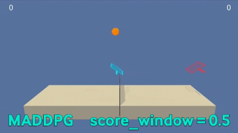

[//]: # (Image References)

[image1]: https://user-images.githubusercontent.com/10624937/42135623-e770e354-7d12-11e8-998d-29fc74429ca2.gif "Trained Agent"
[image2]: https://user-images.githubusercontent.com/10624937/42135622-e55fb586-7d12-11e8-8a54-3c31da15a90a.gif "Soccer"


# Project 3: Collaboration and Competition

### Introduction

For this project, you will work with the [Tennis](https://github.com/Unity-Technologies/ml-agents/blob/master/docs/Learning-Environment-Examples.md#tennis) environment.

![Trained Agent][image1]

In this environment, two agents control rackets to bounce a ball over a net. If an agent hits the ball over the net, it receives a reward of +0.1.  If an agent lets a ball hit the ground or hits the ball out of bounds, it receives a reward of -0.01.  Thus, the goal of each agent is to keep the ball in play.

The observation space consists of 8 variables corresponding to the position and velocity of the ball and racket. Each agent receives its own, local observation.  Two continuous actions are available, corresponding to movement toward (or away from) the net, and jumping. 

The task is episodic, and in order to solve the environment, your agents must get an average score of +0.5 (over 100 consecutive episodes, after taking the maximum over both agents). Specifically,

- After each episode, we add up the rewards that each agent received (without discounting), to get a score for each agent. This yields 2 (potentially different) scores. We then take the maximum of these 2 scores.
- This yields a single **score** for each episode.

The environment is considered solved, when the average (over 100 episodes) of those **scores** is at least +0.5.

### Getting Started

1. Download the environment from one of the links below.  You need only select the environment that matches your operating system:
    - Linux: [click here](https://s3-us-west-1.amazonaws.com/udacity-drlnd/P3/Tennis/Tennis_Linux.zip)
    - Mac OSX: [click here](https://s3-us-west-1.amazonaws.com/udacity-drlnd/P3/Tennis/Tennis.app.zip)
    - Windows (32-bit): [click here](https://s3-us-west-1.amazonaws.com/udacity-drlnd/P3/Tennis/Tennis_Windows_x86.zip)
    - Windows (64-bit): [click here](https://s3-us-west-1.amazonaws.com/udacity-drlnd/P3/Tennis/Tennis_Windows_x86_64.zip)
    
    (_For Windows users_) Check out [this link](https://support.microsoft.com/en-us/help/827218/how-to-determine-whether-a-computer-is-running-a-32-bit-version-or-64) if you need help with determining if your computer is running a 32-bit version or 64-bit version of the Windows operating system.

    (_For AWS_) If you'd like to train the agent on AWS (and have not [enabled a virtual screen](https://github.com/Unity-Technologies/ml-agents/blob/master/docs/Training-on-Amazon-Web-Service.md)), then please use [this link](https://s3-us-west-1.amazonaws.com/udacity-drlnd/P3/Tennis/Tennis_Linux_NoVis.zip) to obtain the "headless" version of the environment.  You will **not** be able to watch the agent without enabling a virtual screen, but you will be able to train the agent.  (_To watch the agent, you should follow the instructions to [enable a virtual screen](https://github.com/Unity-Technologies/ml-agents/blob/master/docs/Training-on-Amazon-Web-Service.md), and then download the environment for the **Linux** operating system above._)

2. Place the file in the DRLND GitHub repository, in the `p3_collab-compet/` folder, and unzip (or decompress) the file. 

### Instructions

Follow the instructions in `Tennis.ipynb` to get started with training your own agent!  

### (Optional) Challenge: Crawler Environment

After you have successfully completed the project, you might like to solve the more difficult **Soccer** environment.

![Soccer][image2]

In this environment, the goal is to train a team of agents to play soccer.  

You can read more about this environment in the ML-Agents GitHub [here](https://github.com/Unity-Technologies/ml-agents/blob/master/docs/Learning-Environment-Examples.md#soccer-twos).  To solve this harder task, you'll need to download a new Unity environment.  (**Note**: Udacity students should not submit a project with this new environment.)

You need only select the environment that matches your operating system:
- Linux: [click here](https://s3-us-west-1.amazonaws.com/udacity-drlnd/P3/Soccer/Soccer_Linux.zip)
- Mac OSX: [click here](https://s3-us-west-1.amazonaws.com/udacity-drlnd/P3/Soccer/Soccer.app.zip)
- Windows (32-bit): [click here](https://s3-us-west-1.amazonaws.com/udacity-drlnd/P3/Soccer/Soccer_Windows_x86.zip)
- Windows (64-bit): [click here](https://s3-us-west-1.amazonaws.com/udacity-drlnd/P3/Soccer/Soccer_Windows_x86_64.zip)

Then, place the file in the `p3_collab-compet/` folder in the DRLND GitHub repository, and unzip (or decompress) the file.  Next, open `Soccer.ipynb` and follow the instructions to learn how to use the Python API to control the agent.

(_For AWS_) If you'd like to train the agents on AWS (and have not [enabled a virtual screen](https://github.com/Unity-Technologies/ml-agents/blob/master/docs/Training-on-Amazon-Web-Service.md)), then please use [this link](https://s3-us-west-1.amazonaws.com/udacity-drlnd/P3/Soccer/Soccer_Linux_NoVis.zip) to obtain the "headless" version of the environment.  You will **not** be able to watch the agents without enabling a virtual screen, but you will be able to train the agents.  (_To watch the agents, you should follow the instructions to [enable a virtual screen](https://github.com/Unity-Technologies/ml-agents/blob/master/docs/Training-on-Amazon-Web-Service.md), and then download the environment for the **Linux** operating system above._)


### Algorithm 

To develop the solution for this environment, I used the DDPG algorithm variant applied to multi-agent systems called Multi-Agent Deep Deterministic Policy Gradient or MADDPG for short.

The differences form the single agent case are:

* During training, the critic for each agent uses extra information like state's observed and actions taken by al the other agents. 

* As for the actor, there is one for each agent. Each actor has access to only its agent's observation and actions.

* During execution time, only the actors are present, and hence, on observations and actions are used.

* Learning critic for each agent allows us to use a different reward structure for each. Hence the algorithm can be used in all, cooperative, competitive and mixed scenarios. 

I basically took the code from the previous project and adapt it to the mutli-agent case. As a reminder, the DDPG algorithm implements a **Replay Buffer** to break correlation among steps. In this case, the buffer is shared across the agents.


The model of the actor is exactly the same as in the single agent case.

```python
class DDPGActor(nn.Module):
    """Actor (Policy) Model."""

    def __init__(self, state_size, action_size, seed, fc1_units=256, fc2_units=128):
        """Initialize parameters and build model.
        Params
        ======
            state_size (int): Dimension of each state
            action_size (int): Dimension of each action
            seed (int): Random seed
            fc1_units (int): Number of nodes in first hidden layer
            fc2_units (int): Number of nodes in second hidden layer
        """
        super(DDPGActor, self).__init__()
        self.seed = torch.manual_seed(seed)
        self.fc1 = nn.Linear(state_size, fc1_units)
        self.fc2 = nn.Linear(fc1_units, fc2_units)
        self.fc3 = nn.Linear(fc2_units, action_size)
        self.reset_parameters()

    def reset_parameters(self):
        self.fc1.weight.data.uniform_(*hidden_init(self.fc1))
        self.fc2.weight.data.uniform_(*hidden_init(self.fc2))
        self.fc3.weight.data.uniform_(-3e-3, 3e-3)

    def forward(self, state):
        """Build an actor (policy) network that maps states -> actions."""
        x = F.relu(self.fc1(state))
        x = F.relu(self.fc2(x))
        return F.tanh(self.fc3(x))
```

On the other hand, there is one change in the critic. The input is the sum of the size of the space state vector and the size of the action space vector times the number of agents.

```python
class DDPGCritic(nn.Module):
    """Critic (Value) Model."""

    def __init__(self, state_size, action_size, seed, fcs1_units=256, fc2_units=128):
        """Initialize parameters and build model.
        Params
        ======
            state_size (int): Dimension of each state
            action_size (int): Dimension of each action
            seed (int): Random seed
            fcs1_units (int): Number of nodes in the first hidden layer
            fc2_units (int): Number of nodes in the second hidden layer
        """
        super(DDPGCritic, self).__init__()
        self.seed = torch.manual_seed(seed)
        self.fcs1 = nn.Linear((state_size + action_size)*2, fcs1_units)
        self.fc2 = nn.Linear(fcs1_units, fc2_units)
        self.fc3 = nn.Linear(fc2_units, 1)
        self.reset_parameters()
        self.bn = nn.BatchNorm1d(fcs1_units)

    def reset_parameters(self):
        self.fcs1.weight.data.uniform_(*hidden_init(self.fcs1))
        self.fc2.weight.data.uniform_(*hidden_init(self.fc2))
        self.fc3.weight.data.uniform_(-3e-3, 3e-3)

    def forward(self, state, action):
        """Build a critic (value) network that maps (state, action) pairs -> Q-values."""
        xs = torch.cat((state, action), dim=1)
        x = F.relu(self.fcs1(xs))
        x = F.relu(self.fc2(x))
        return self.fc3(x)
```

Also there are some changes in the replay buffer. Due to the fact that the state observation from the environment is from both agents in the tennis games, when sampling and building the batches, you should build a batch for each agent. So, the sample outputs a natch of each agent as a list.

```python
class Replaybuffer:
    def sample(self):
            """Randomly sample a batch of experiences from memory."""
            experiences = random.sample(self.memory, k=self.batch_size)
            
            states = [torch.from_numpy(np.vstack([e.state[i_agent] for e in experiences if e is not None])).float().to(device) for i_agent in range(self.num_agents)]
            actions = [torch.from_numpy(np.vstack([e.action[i_agent] for e in experiences if e is not None])).float().to(device) for i_agent in range(self.num_agents)]
            next_states = [torch.from_numpy(np.vstack([e.next_state[i_agent] for e in experiences if e is not None])).float().to(device) for i_agent in range(self.num_agents)]            
            rewards = torch.from_numpy(np.vstack([e.reward for e in experiences if e is not None])).float().to(device)        
            dones = torch.from_numpy(np.vstack([e.done for e in experiences if e is not None]).astype(np.uint8)).float().to(device)

            return (states, actions, rewards, next_states, dones)
```

Finally, I created a new class called `MADDPG` that is a helper class that handles every agent separately and helps to step and act for each agent.

```python

class MADDPG:

    def __init__(self, random_seed):
        self.agents = [DDPGAgent(state_size,action_size,random_seed) for i in range(num_agents)]
        self.memory = ReplayBuffer(ddpg_agent.BUFFER_SIZE, ddpg_agent.BATCH_SIZE, random.seed(random_seed))

    def step(self, states, actions, rewards, next_states, dones, t):
        self.memory.add(states, actions, rewards, next_states, dones)

        for agent in self.agents:
            agent.step(self.memory, t)

    def act(self, states, add_noise=True):
        actions = np.zeros([num_agents, action_size])
        for i, agent in enumerate(self.agents):
            actions[i, :] = agent.act(states[i], add_noise)
        return actions
    
    ## Save the model along with some training information
    def save_checkpoint(self, checkpoint_name, i_episode, time_elapsed_str, scores, window_avg):
        checkpoint = {
            'ddpg_params': {
                'batch_size': ddpg_agent.BATCH_SIZE,
                'buffer_size': ddpg_agent.BUFFER_SIZE,
                'gamma': ddpg_agent.GAMMA,
                'lr_actor': ddpg_agent.LR_ACTOR,
                'lr_critic': ddpg_agent.LR_CRITIC,
                'tau': ddpg_agent.TAU,
                },
            'episodes': i_episode,
            'elapsed_time': time_elapsed_str,
            'scores': scores,
            'moving_avg': window_avg,
            }
        for i, agent in enumerate(self.agents):
            checkpoint["agent{}".format(i+1)] = {'actor_dict': agent.actor_local.state_dict(),
                                                 'critic_dict': agent.critic_local.state_dict()}
        
        print('\nSaving model ...', end=' ')
        torch.save(checkpoint, checkpoint_name)
        print('done.')

    def reset(self):        
        for agent in self.agents:
            agent.reset()
```


* To train a tennis multiagent, run the section 4 on the [Tennis](./Tennis.ipynb) jupyter notebook.

### Results

On the checkpoint `test_clip.png`, the agents was trained according the next hyperparameters:

```
BATCH_SIZE: 256
BUFFER_SIZE: 100000
GAMMA: 0.99
LR_ACTOR: 0.0001          
LR_CRITIC: 0.001
TAU: 0.001
solved in: 2115 episodes          
training time: 00h46m12s
```

The environment was solved in **2,115** episodes and the final window average was **0.502**.

You can see on the following gift the evaluation of the performance of the agent under the policy of the previous checkpoint.



The following plot shows the score average per episode on green and over 100 episodes on red.


### Ideas for future work

* Prioritize experience replay should be an interesting approach to compare with. Due to the update rate, some rare states are never used for training. 

* Implement Proximal Policy Optimization (PPO), which has also demonstrated good performance with continuous control tasks for a multi-task scenario.

* On the previous project, D4PG showed an outstanding performance and low variance when acting. It should be interesting to apply it to a multi-task scenario.